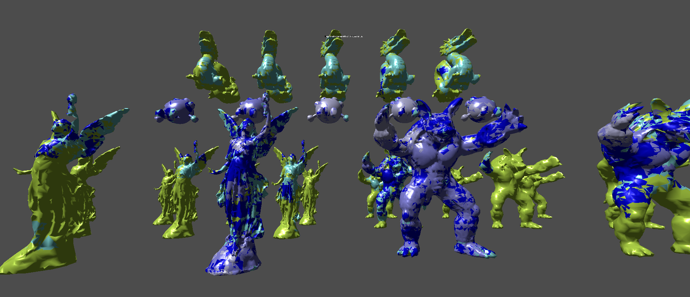
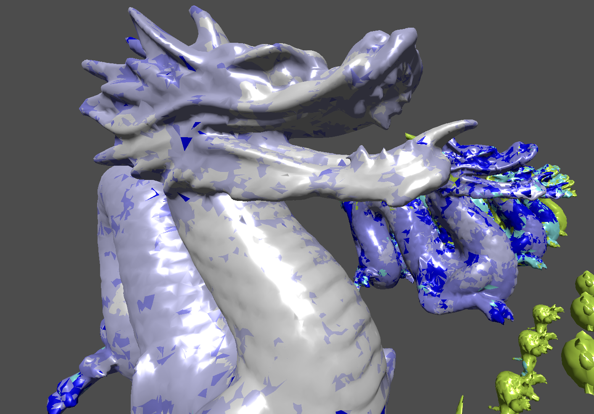
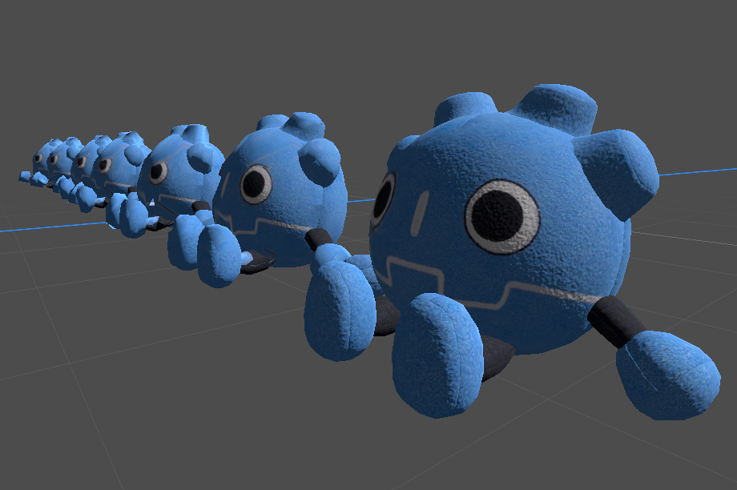
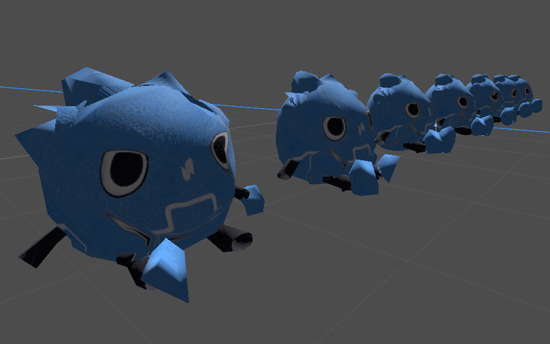

# GodotNanite (or GeoStream)
Fundamentally, this project is about mesh streaming. The idea is that instead of loading an entire mesh into VRAM, we only load parts of the mesh that are visible and close to the camera. As we get further away we load lower detailed geometry from higher LODs. To do this we break our geometry into chunks that we can load individually into VRAM.
Currently there are many limitations to what this can do is not as capable as UE’s Nanite. I would not recommend using this in a serious project. This will mostly serve as a learning resource.

## Geo Stream
Here are some notable inspector variables
* **combine_all_geometry**: Combines all generated geometry into one mesh. Otherwise, use RenderServer to render individual meshes.
* **stream_update_time**: How fast the Geostreamed meshes are updated. Could be slower depending on your computer.
* **lod_distance_factor**: Affects the distance LOD chunks change detail. Bigger = you need to be closer to an object to see LOD changes, Smaller = LODs change at a farther distance.
* **ignore_depth**: Ignore Depth when selecting LOD Chunks. All chunk data will be selected purely based on its size / distance from camera.
* **my_geostreamed_objects** : All of the GeoStreamed objects. If you want to add more objects or stop objects from being streamed, you need to edit this array. Make sure new object have had there LOD chunks generated and that they have a ‘GeoStreamedObject’ script attached and the ‘mesh_path’ string is set.

## Lod Chunk Generator 
Here are some notable inspector variables

* **max_lods**: Maximum number of LODs to generate. Will stop generating LODs if the min_lod_poly_count is reached first.
* **min_lod_poly_count**: Minimum polygon count before stopping LOD generation. Will stop generating LODs if max_lods is reached first.
* **max_depth**: Maximum level of BVH divisions. Our mesh is divided using a Bounding Volume Hierarchy and this is an upper cap to the number of divisions.
* **volume_vert_capacity**: Maximum vertex count for a BVH volume. We keep dividing our volumes until we reach this number of verticies.
* **save_whole_lods**: Enable this option to save whole LOD meshes where all the chunks are combined at each level. In theory, you could use this to generate tradtional LODs.
* **mesh_instance_3d**: The GeoStreamed object you want to generate LOD Chuncks for. Make sure it has the ‘GeoStreamedObject’ script attached and the ‘mesh_path’ string is set.

## UV Support
One thing I wanted to show off was UVs working with Chunk LODs.

And from the other side.

## Limitations
* Multiple Materials: Currently, all objects streamed must share the same material. The material I am using simply displays the vertex color to help visualize the LODs.
* Baked Lighting: Lightmapping is not supported. This is because UV2 data is not shared among all like meshes in the same way UV / normal / tangent / vertex color data is. 
* No multi-camera support
* Flickering
* Relies primarily on RAM for storage and on Multithreaded CPU performance
* Chunk generation can take a long time depending on how complex your mesh is. For me it took around 10 minutes to generate the Dragon's LOD chunks.

## Attribution
Godot Plush by FR3NKD

Lucy, Dragon, and Armadillo by Stanford Computer Graphics Laboratory.

